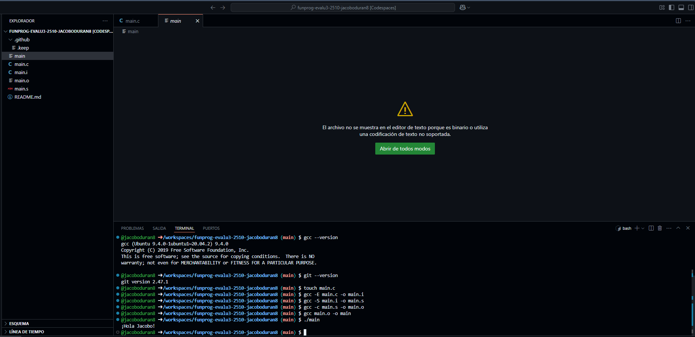

# Actividad 1 - Pipeline de compilación

En esta actividad visualizamos cada etapa en la etapa de compilación de un archivo.

En esta foto se visualiza el proceso y como con **gcc** se va ejecutando el preprocesador con: `gcc -E main.c -o main.i` se ejecuta el preprocesador, la cuál es la primera fase de compilación se encarga de analizar el codigo fuente y tiene como resultado un codigo fuente expandido que ya está listo para ser compilado. Después con `gcc -S main.i -o main.s` se compila a ensamblador. El compilador traduce el archivo preprocesado `main.i` y lo traduce a lenguaje ensamblador. Y da como resultado un archivo `.s`. Ya después se genera el objeto con `gcc -c main.s -o main.o`, con esto el ensamblador convierte el codigo `.s` a codigo objeto `.o` y ya contiene el código máquina. Sin embargo, todavia no es ejecutable. Y por último se linkea para crear el ejecutable con `gcc main.o -o main` El linker 
